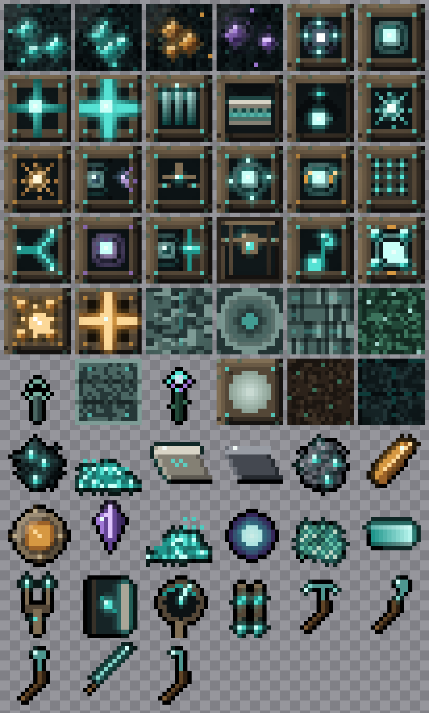
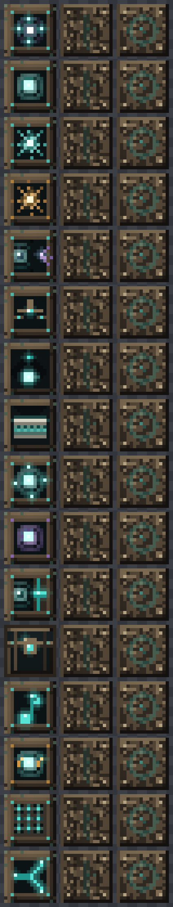

# Octaves of the One

A Fabric mod for Minecraft **1.21.x** themed on **Walter Russell's cosmology** — the
*two-way universe* of **rhythmic balanced interchange**. Draw **Light** from the still
centre of zero, wind it through the octaves by **generation** (compression / charging)
and **radiation** (expansion / discharging), and spend it across a wired and wireless
grid to power machines, flight, and deliberately over-tuned gear.

> Energy is *carried, not consumed* — see [`docs/cosmology.md`](docs/cosmology.md) for
> how every block maps to Russell's system. *(The framing is flavour, not physics.)*
> Internally the namespace stays `echoes` (save-compatible); the rework is a complete
> display reskin plus new content like the **Stillness Core**.

## 📖 Wiki

The full wiki is a themed, searchable **HTML site** — one page per block/item,
with **clickable crafting grids** (every ingredient links to its own page):

### → **https://trystar360.github.io/echoes-of-the-deep/**

It's generated from the mod's own textures, recipes, and lang file by
[`scripts/build_wiki_site.py`](scripts/build_wiki_site.py) into
[`docs/site/`](docs/site/), and published by the
[Pages workflow](.github/workflows/pages.yml). To preview locally, open
`docs/site/index.html` in a browser. *(One-time: in **Settings → Pages**, set the
source to **GitHub Actions** to make the URL above go live.)*

<sub>Older long-form Markdown reference still lives in [`docs/wiki/`](docs/wiki/Home.md)
and can be mirrored to the repo's Wiki tab with
[`scripts/publish-wiki.sh`](scripts/publish-wiki.sh).</sub>

## What's inside

A complete, end-to-end energy + logistics loop, craftable from scratch in survival:

- **Resonance energy core** — `ResonanceNode` capability, bounded `ResonanceStorage`,
  and `ResonanceNetwork` with a **largest-remainder fair distribution** algorithm
  (proportional under scarcity, no starvation, surplus flows to storage).
- **Incremental network manager** — `ResonanceNetworkManager` merges/splits networks
  on conduit place/break with **no per-tick flood fill**; the only expensive path is a
  split check when a conduit is removed.
- **Ambient capture** — a `LivingEntity#onDeath` mixin (25 RU) plus a
  `ServerWorld#playSound` mixin that charges the nearest Resonator from a data-driven
  sound→RU table (`data/echoes/resonance_sources.json`, reloadable, modpack-extendable):
  note blocks, anvils, bells, explosions, thunder, and more.
- **Blocks** — Echocite ore (+deepslate), Drumstone ore, Silentite ore, **Resonator**
  (provider+storage, comparator-readable), **Tuning Conduit** (carrier), **Crusher**
  (consumer, ore-doubling).
- **Resonant Relay** — a cheap, powerful **wireless transport** block. Tune two or
  more to the same channel (one per dye colour) and they resonate, beaming **items,
  fluids, and RU** between the blocks they face — no conduit required. Right-click to
  cycle mode (Receive/Send/Disabled), sneak-click or use a dye to set the channel.
  Items/fluids ride the Transfer API (vanilla chests & tanks work); RU bridges the
  `ResonanceNode` grid.
- **Wireless transport family** — a full system of channel gadgets around the relay:
  **Resonant Amplifier** (widens a channel's throughput), **Harmonic Filter**
  (item whitelist), **Resonant Splitter** (round-robin vs. fill-first), **Echo
  Repeater** (cross-dimension channels), **Conduit Coupler** (bridges the wired RU
  grid), **Resonant Chest** (storage natively on a channel), **Note Relay** (wireless
  redstone bus), plus the **Frequency Tuner** and **Channel Atlas** tools. See
  [`docs/wireless_transport.md`](docs/wireless_transport.md) for the full design.
- **Crusher machine** — full block entity with a synced screen, a custom `crushing`
  recipe type (`CrushingRecipe`), and **Transfer API item I/O so vanilla hoppers work**.
- **The Octave Grove (botanical octave)** — a full luminous garden system: the
  **Lumewood** tree (log/wood, planks, stairs, slab, fence, gate, trapdoor, glowing
  leaves & sapling) that generates in forests, **Lumebloom** (a glowing flower) and the
  **Lume Lantern** for décor, plus **Echocite Bricks** (+ stairs & slab) masonry.
  **Verdant Loam** is a configurable growth block that pulses Light upward to grow
  nearby plants over a tunable radius/interval — utilitarian *and* pretty to build with.
- **Octaves & transmutation (Phase II progression)** — the **Octave Seed** catalyst
  feeds **Radiant Dust → Radiant Ingot**, which builds the **Greater Accumulator**, a
  block-of-light bank (2,000,000 Light) with a comparator output and full config GUI.
  Radiant Ingots also forge the higher-octave grid tier: the **Octave Coil** (a strong
  baseline generator with a tunable rate) and the **Octave Conduit** (64,000 Light/t,
  4× the Dense Conduit).
- **Storm Caller** — a conductive spire that, during thunderstorms, calls lightning to
  itself far more often than nature would and banks the windfall (40,000 Light per
  strike). Needs open sky; the self-struck bolts are cosmetic, so it powers the grid
  without ever igniting a build.
- **Worldgen** — configured/placed ore features for Echocite & Drumstone (Overworld)
  and Silentite (rare, Deep Dark only) plus the Lumewood grove, attached via
  `BiomeModifications`.
- **Crafting & progression** — Echocite ore → `raw_echocite` → smelt/blast to **Echo
  Ingot** (or crush to dust for ore-doubling, then smelt). Echo Ingot + dust + iron
  build the Resonator, Tuning Conduit, Crusher, and the whole wireless family; every
  recipe is reachable in survival (verified by an obtainability checker).
- Loot tables (all ores), recipes, lang, blockstates, directional models, a mod icon,
  and a creative tab.

## Build & run

✅ **This builds and runs.** Verified against Minecraft **1.21.4**, Yarn `1.21.4+build.8`,
Loom `1.9.2`, Fabric API `0.119.2+1.21.4`, Gradle `8.12`, JDK 21. The mod loads on a
dedicated server: registries populate, the `LivingEntity#onDeath` mixin applies, all
recipes parse (1405 total), and the Echocite worldgen attaches via biome modifications
(`Applied 54 biome modifications`).

```bash
brew install openjdk@21          # if you don't already have a JDK 21

# The wrapper launcher needs JAVA_HOME (no system Java on this machine):
export JAVA_HOME="$(brew --prefix openjdk@21)/libexec/openjdk.jdk/Contents/Home"
# (add that line to ~/.zshrc to make it permanent)

./gradlew build                  # → build/libs/echoes-of-the-deep-0.1.0.jar
./gradlew runClient              # playtest in single-player
./gradlew runServer              # headless smoke test (accept the EULA in run/eula.txt)
```

Or just use the bundled wrapper that sets `JAVA_HOME` for you:

```bash
./run.sh build      # ./run.sh runClient | runServer | <any gradle task>
```

The Gradle wrapper is pinned to 8.12 and `gradle.properties` points `org.gradle.java.home`
at the brew JDK 21 for the build itself. If your `JAVA_HOME` already points at a JDK 21,
you can delete that line.

To install into a real instance, drop `build/libs/echoes-of-the-deep-0.1.0.jar` into
`.minecraft/mods/` alongside **Fabric Loader** and **Fabric API** for 1.21.4.

## Roadmap & possible improvements

📜 **The full project map lives in [`docs/roadmap.md`](docs/roadmap.md)** — a cohesive
plan organized by Russell's cosmology (Phase I the generation↔radiation duality, II the
octaves, III the wave, …). Recent additions: ✅ **Stillness Core** (baseline Light from
the still centre) and ✅ **Radiator** (the radiation half — a Light-fed crop-growth aura).

🌱 **New proposal (awaiting sign-off):**
[`docs/botanicals-proposal.md`](docs/botanicals-proposal.md) — *The Verdant Octave*, a
Mystical-Agriculture–style botanical suite (food crops, decorative flora, new wood
types, and an ores/materials crop economy built on one base crop that grows **Light**
and **gains energy to climb the octaves** — the more energy wound into a Mote, the
higher its octave and the heavier the element it becomes, grounded in Russell's
octave-wave cosmology).

The list below is the prior, still-accurate history. Nothing here is load-bearing — the
mod is complete and survival-craftable as-is.

**Content gaps (close the loop)**
- ✅ **Drumstone & Silentite tiers** — done. Both ores now generate (Drumstone in the
  Overworld, Silentite in the Deep Dark); Drumstone shards craft the **Drum Core**
  (an alternate Resonator membrane), and Silentite crystals craft an alternate **Echo
  Repeater**. All three items are now survival-obtainable.
- ✅ **Crusher byproducts** — done. `CrushingRecipe` gained an optional
  `secondary` + `secondaryChance`; the Crusher has a third (byproduct) slot.
  Crushing raw echocite now yields a ~15% **Resonant Slag**, which smelts to a
  **Dull Ingot** (an alternate cheap conduit material). **Every item in the mod is
  now survival-obtainable** — no creative-only stubs remain.
- ✅ **`ServerWorld#playSound` mixin** — done. A data-driven sound→RU table
  (`resonance_sources.json`, loaded via a reload listener) now charges the nearest
  Resonator from ambient world sound, not just mob deaths. *(All "close the loop"
  content gaps are now complete.)*

**Systems & polish**
- ✅ **Persist networks** — done. The wired grid (`ResonanceNetworkManager`) now
  saves its conduit topology to a `PersistentState`, so networks survive a server
  restart instead of going dark until a conduit is re-placed. (The wireless side
  already self-heals: every device carries its channel/mode in NBT and re-registers
  on load.)
- ✅ **Harmonic Filter GUI** — done. A 3×3 **ghost-slot** screen sets the channel's
  item whitelist (samples aren't consumed); **fluids** are filtered by their bucket
  item, so a water bucket in the grid whitelists water. (The Splitter already toggles
  round-robin vs. fill-first; per-target priority ordering remains open.)
- **True emissive textures** — ship an optional Continuity/Indium integration so the
  resonance cores glow fullbright in the dark (today they frame-animate/pulse).
- ✅ **Cross-mod energy bridge** — done. An optional Team Reborn Energy bridge
  exposes the Resonator's and Conduit Coupler's RU buffers as `EnergyStorage`
  (1 RU = 1 E), so other tech mods can read and feed the grid. Compiled against the
  TR Energy API as a `modCompileOnly` soft dependency and gated by `isModLoaded`, so
  it activates only when a 1.21.x-compatible Team Reborn Energy is installed and is
  completely inert otherwise.

**Future blocks/items (from the design spec)**
- ✅ **Attunement Furnace** — done. An RU-powered machine that smelts *any vanilla
  furnace recipe* (no fuel), drawing from the grid like the Crusher. Directional
  model + its own screen.
- ✅ **Resonance Capacitor** — done. Bulk STORAGE node (250k RU) so the grid can
  bank surplus instead of being capped at the Resonators' small reserves;
  comparator-readable.
- ✅ **Dense Tuning Conduit** — done. A ×16 throughput conduit (16k RU/t) for
  feeding many or hungry consumers without huge conduit bundles.
- ✅ **Resonance Meter** — done. Handheld diagnostic: right-click any Resonance
  device to read its role, stored / capacity RU, demand, and conduit throughput
  (RU is otherwise invisible).
- ✅ **Resonance Thrusters** — done. Sound-powered flight: hold *use* to fly in the
  direction you look (sprint = faster, sneak = hover/brake), with **fall-damage
  immunity** while you carry a charged set. Cheap to fly off a huge reserve;
  recharge by right-clicking a Resonator / Capacitor / Coupler. Portable RU lives on
  the item via a `stored_ru` data component — fully server-side, no client mod.
- ✅ **Resonant tools** — done. A full set (pickaxe/axe/shovel/sword/hoe) on the
  **Echo** tool material: faster than netherite (speed 12), 4000 durability, mines
  anything, highly enchantable (22), with a hefty attack bonus. Deliberately strong.
- Resonance Centrifuge, Echo Forge; Silence Cloak (+ Trinkets compat).

> **Design note.** The gear is intentionally over-tuned, framed in-world by Walter
> Russell's *rhythmic balanced interchange* — Resonance is *carried, not consumed*,
> so a device tuned to its octave gives back as freely as the grid pours in. (Flavour,
> not physics.) Tune the constants in `ResonanceThrustersItem` / `ModItems.ECHO_MATERIAL`
> to taste.

## Art

All textures are procedurally generated by `gen_textures.py` in one cohesive
**"deep resonance"** style — deep-dark sculk bases, patinated bronze bezels with
verdigris and rune-etched corners, teal resonance with bloom, and a recurring
concentric sound-wave ripple motif (amethyst for dimensional gear, amber for
percussive gear). Machine blocks use **directional models**: a glowing front that
orients to the player over a shared bronze side/top casing, so the family reads as
one material. The resonance cores are **frame-animated** so they breathe (vertical
animation strips + `.mcmeta`; true fullbright emissivity would need a client mod
like Continuity).

Every block and item texture (animated sprites shown at their brightest frame):



Machine blocks are directional — a glowing **front** over a shared bronze
**side** / **top** casing, so the whole family reads as one material:



Regenerate the sprites with `python3 gen_textures.py`, and the gallery images above
with `python3 gallery.py` (or `python3 montage.py` for a zoomed `/tmp` preview). The
wiki's visuals are generated by `python3 scripts/gen_wiki_icons.py` (flat icons),
`gen_wiki_blocks3d.py` (isometric 3D block renders), and `gen_wiki_recipes.py`
(crafting-grid widgets).

## Layout

```
src/main/java/com/echoes/
  energy/   ResonanceNode, ResonanceStorage, ResonanceNetwork, ...Manager, ResonanceEvents
  block/    ResonatorBlock, ConduitBlock, CrusherBlock  (+ entity/)
  recipe/   CrushingRecipe, ModRecipes
  screen/   CrusherScreenHandler
  registry/ ModBlocks, ModItems, ModBlockEntities, ModScreens, ModItemGroups, ModWorldGen
  mixin/    LivingEntityMixin
src/client/java/com/echoes/client/  EchoesClient, screen/CrusherScreen
src/main/resources/  fabric.mod.json, echoes.mixins.json, assets/, data/
```
