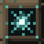

# Blocks

[← Home](Home.md)

Every block, grouped by purpose. Each lists its **in-world name**, internal id,
network role, and key constants. Recipes are on
[Crafting & Progression](Crafting-and-Progression.md); wireless gadgets get their
own page, [Wireless Transport](Wireless-Transport.md).

> Machine blocks are **directional**: a glowing front orients to the player over
> a shared bronze side/top casing, so the whole family reads as one material. The
> resonance cores are frame-animated so they appear to "breathe".

*Every machine shown as **front | side | top** — a glowing front orients to the
player over a shared bronze casing, so the family reads as one material.*

## Generation & storage

###  Stillness Core — `echoes:stillness_core`
*The still magnetic centre of zero.* A slow **baseline generator**: PROVIDER +
STORAGE, **50,000 RU** capacity, **+4 RU/t** steady generation. The only block
that makes Light with no input — "motion springs from rest."

###  Generative Coil — `echoes:resonator`
*Generation / centripetal charging.* PROVIDER + STORAGE, **10,000 RU**. Charges
from **ambient sound** and nearby **mob deaths** (see
[Ambient Capture](Ambient-Capture.md)). Comparator-readable. Right-click it (or a
Capacitor / Coupler) to recharge **Centrifugal Thrusters**. Craftable from a
**Drum Core** as an alternate membrane.

###  Accumulator — `echoes:resonance_capacitor`
*Locked potential.* Bulk **STORAGE**, **250,000 RU**, so the grid can bank
surplus instead of being capped at the Coils' small reserves. Comparator-readable.

## Transport (wired)

###  Wave Conduit — `echoes:tuning_conduit`
The carrier of the wired grid. CONDUIT role, **1,000 RU/t** throughput, no buffer.
Crafts **4 at a time**; also craftable from **Dull Ingots**.

###  Dense Wave Conduit — `echoes:dense_conduit`
A **×16** conduit, **16,000 RU/t**, for feeding many or hungry consumers without
huge conduit bundles.

## Machines (consumers)

###  Compressor — `echoes:crusher`
*Compression = generative motion.* CONSUMER with a **1,000 RU** buffer and a
synced screen. Runs a custom **`crushing`** recipe type for **ore-doubling**
(raw echocite → 2× dust), with an optional **secondary byproduct** (raw echocite
→ ~15% Resonant Slag). Item I/O rides the **Transfer API**, so **vanilla hoppers
work** — input from the top, output on the sides.

###  Transmuter — `echoes:attunement_furnace`
*Raising matter an octave.* CONSUMER with a **1,000 RU** buffer. Smelts **any
vanilla furnace recipe with no fuel**, drawing from the grid (~4 RU/t over a
~100-tick smelt). Directional model and its own screen; hopper-friendly.

## Radiation (the discharge half)

###  Radiator — `echoes:radiator`
*Radiation / centrifugal outpouring.* CONSUMER, **3,000 RU** buffer. Pours Light
back into the world as **life**: every 10 ticks it makes several growth attempts
(≈8) on crops & saplings in a **4×2 (h×v)** radius for **~300 RU** per success,
and glows.

###  Warmth Radiator — `echoes:warmth_radiator`
Radiates **heat**: cooks dropped items on the ground (vanilla smelting, ~60 RU
each) and melts nearby snow & ice within ~4 blocks. A powered "campfire of Light"
that glows brightly. CONSUMER, **3,000 RU** buffer.

## Fields & balance

###  Polarity Field — `echoes:polarity_field`
*The two poles of one device.* CONSUMER, **3,000 RU** buffer, **~20 RU** per
action every **5 ticks**, radius **6**. Right-click to toggle:
- **Attract** (centripetal) — pulls in nearby items & XP.
- **Repel** (centrifugal) — throws mobs outward.

###  Balancer — `echoes:balancer`
*Rhythmic balanced interchange.* Nudges every STORAGE node on its network toward
the **same fill ratio** (≈2,000 RU/t, every 10 ticks) so no Accumulator hoards.

## Wireless devices

The wireless family — **Wave Relay**, **Amplitude Coil**, **Harmonic Filter**,
**Interchange Splitter**, **Octave Repeater**, **Polarity Coupler**, **Locked
Potential Vault**, **Tone Relay** — has its own page:
[Wireless Transport](Wireless-Transport.md).

## Ores

**Echocite Ore** (+ deepslate), **Drumstone Ore**, and **Silentite Ore** are
documented on [Ores & Worldgen](Ores-and-Worldgen.md).

## Quick stat table

| In-world name | Id | Role(s) | Capacity | Notes |
| --- | --- | --- | --- | --- |
| Stillness Core | `stillness_core` | Provider+Storage | 50,000 | +4 RU/t baseline |
| Generative Coil | `resonator` | Provider+Storage | 10,000 | ambient capture, recharges thrusters |
| Accumulator | `resonance_capacitor` | Storage | 250,000 | comparator-readable |
| Wave Conduit | `tuning_conduit` | Conduit | — | 1,000 RU/t |
| Dense Wave Conduit | `dense_conduit` | Conduit | — | 16,000 RU/t |
| Compressor | `crusher` | Consumer | 1,000 | ore-doubling + byproduct |
| Transmuter | `attunement_furnace` | Consumer | 1,000 | fuel-free smelting |
| Radiator | `radiator` | Consumer | 3,000 | grows crops, ~300 RU/grow |
| Warmth Radiator | `warmth_radiator` | Consumer | 3,000 | cooks drops, melts ice |
| Polarity Field | `polarity_field` | Consumer | 3,000 | Attract/Repel, ~20 RU/action |
| Balancer | `balancer` | (network util) | — | evens storage fill ratios |
| Polarity Coupler | `conduit_coupler` | Storage | — | wired ↔ wireless bridge |

*Constants are the in-code defaults and may be tuned by a pack author.*
