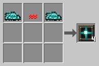
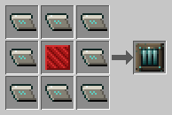
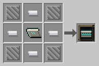
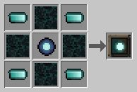
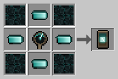
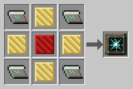
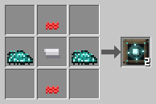
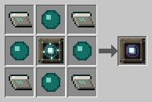
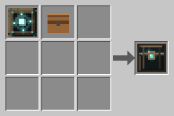
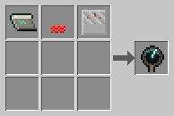

# Crafting & Progression

[← Home](Home.md)

Every recipe in the mod, shown as crafting-grid widgets, and the order they unlock
in. All recipes are reachable in survival — there are no creative-only items
(verified by an obtainability checker).

> Recipe images are generated from the real textures by
> [`scripts/gen_wiki_recipes.py`](https://github.com/Trystar360/echoes-of-the-deep/blob/main/scripts/gen_wiki_recipes.py);
> vanilla ingredients use compact pixel-art stand-ins. The text key under each
> "▸ layout" toggle is the source of truth.

## The tech-tree spine

```
Echocite Ore ──mine──▶ Raw Echocite
                         │
              ┌──────────┴───────────┐
         smelt/blast              Compressor (crush)
              │                        │
              ▼                        ▼
         Echo Ingot ◀──smelt──  Echocite Dust ×2  (+ ~15% Resonant Slag)
              │                        │                     │
              │                        │                  smelt
   ┌──────────┼───────────┐           +Glowstone Dust        ▼
   ▼          ▼           ▼            ▼                  Dull Ingot
 Machines  Conduits     Tools      Echo Dust                 │
 Wireless  Thrusters   (Echo mat)  (Wave Atlas)        Wave Conduit (alt)
```

**Echo Ingot** gates almost everything. Side lines: **Drum Core** (from Drumstone)
feeds the Coil and Thrusters; **Silentite Crystal** (Deep Dark) feeds the
Stillness Core and an alternate Wave Repeater; **Dull Ingot** (from Slag) is a
cheap conduit material.

## Smelting & crushing

| | Recipe | Notes |
| --- | --- | --- |
|  | Raw Echocite → **Echo Ingot** | smelt or blast · 0.7 xp · 200t |
|  | Echocite Dust → **Echo Ingot** | the dust route after crushing |
|  | Raw Echocite → **2× Echocite Dust** | **Compressor** · +15% Resonant Slag |
|  | Resonant Slag → **Dull Ingot** | smelt · 0.3 xp |

## Core blocks

### Resonant Coil


<details><summary>▸ layout</summary>

```
i e i     i = iron ingot
e c e     e = echocite dust
i e i     c = echo ingot
```
Also craftable with a **Drum Core** in the centre instead of an Echo Ingot.
</details>

### Wave Conduit (makes 4)


<details><summary>▸ layout</summary>

```
e r e     e = echocite dust   r = redstone
```
Alt: `d r d` with **Dull Ingots** in place of dust.
</details>

### Dense Wave Conduit (makes 2)


<details><summary>▸ layout</summary>

Shapeless: 3× **Wave Conduit** + **Echo Ingot**.
</details>

### Resonance Cell


<details><summary>▸ layout</summary>

```
e e e     e = echo ingot
e R e     R = redstone block
e e e
```
</details>

### Stillness Core


<details><summary>▸ layout</summary>

```
e s e     e = echo ingot
s R s     s = silentite crystal
e s e     R = redstone block
```
</details>

### Compressor


<details><summary>▸ layout</summary>

```
C I C     C = cobblestone
I e I     I = iron ingot
C I C     e = echo ingot
```
</details>

### Transmuter


<details><summary>▸ layout</summary>

```
. e .     e = echo ingot
e F e     F = furnace
. e .
```
</details>

### Transmutation Table


<details><summary>▸ layout</summary>

```
R b R     R = radiant ingot
b S b     b = echocite bricks
R b R     S = octave seed
```
</details>

### Transmutation Tablet


<details><summary>▸ layout</summary>

```
b R b     R = radiant ingot
R L R     b = echocite bricks
b R b     L = light meter
```
</details>

The **EMC economy** (*Bound Light*): each player has a personal account (banked Light +
attuned tones). At a Table **or** the portable Tablet you **Dissolve** matter (bank its
**Light Value** + attune it), **Withdraw** Mote coins
(`Light → Tonic → Mediant → Dominant → Harmonic`, ×4 per octave), or **Condense** an
attuned item from the ghost template slot. Values are data-driven
(`data/echoes/light_values.json`). See
[the Mote ladder & the Tablet](Items-and-Gear.md#the-transmutation-economy--bound-light-emc).

## Radiation & field blocks

### Growth Radiator


<details><summary>▸ layout</summary>

```
e g e     e = echo ingot
g R g     g = glowstone
e g e     R = redstone block
```
</details>

### Warmth Radiator


<details><summary>▸ layout</summary>

```
e b e     e = echo ingot
b R b     b = blaze powder
e b e     R = redstone block
```
</details>

### Polarity Field


<details><summary>▸ layout</summary>

```
e r e     e = echo ingot
r I r     r = redstone
e r e     I = iron block
```
</details>

### Balancer


<details><summary>▸ layout</summary>

```
e c e     e = echo ingot
e R e     c = comparator
e c e     R = redstone block
```
</details>

## Wireless family

The **Wave Relay** is the root; every other channel gadget is a relay upgrade.

### Wave Relay (makes 2)


<details><summary>▸ layout</summary>

```
. R .     R = redstone
e I e     e = echocite dust
. R .     I = iron ingot
```
</details>

### Wave Amplifier


<details><summary>▸ layout</summary>

```
e r e     e = echo ingot   r = redstone
r R r     R = wave relay
e r e
```
</details>

### Wave Repeater


<details><summary>▸ layout</summary>

```
e p e     e = echo ingot   p = ender pearl
p R p     R = wave relay
e p e
```
Alt: **Silentite crystals** in place of ender pearls.
</details>

### Relay upgrades (shapeless)

| | Result | Ingredients |
| --- | --- | --- |
|  | **Wave Coupler** | Wave Relay + Wave Conduit + Echo Ingot |
|  | **Signal Relay** | Wave Relay + note block |
|  | **Wave Chest** | Wave Relay + chest |
|  | **Wave Filter** | Wave Relay + hopper + iron ingot |
|  | **Wave Splitter** | Wave Relay + comparator |

## Tools & gear

### Resonant Thrusters


<details><summary>▸ layout</summary>

```
d . d     d = drum core
e p e     e = echo ingot
e . e     p = redstone block
```
</details>

### Drum Core


<details><summary>▸ layout</summary>

```
. s .     s = drumstone shard
s i s     i = iron ingot
. s .
```
</details>

### Resonant tools

Standard vanilla tool shapes with **Echo Ingot** heads and stick handles. See
[Items & Gear](Items-and-Gear.md) for their (deliberately over-tuned) stats.

  
 

## Handheld tools

| | Result | Ingredients |
| --- | --- | --- |
|  | **Light Meter** | Echo Ingot + redstone + comparator |
|  | **Wave Tuner** | 2 Echo Ingot + 2 redstone |
|  | **Wave Atlas** | book + Echo Dust |
|  | **Echo Dust** | Echocite Dust + Glowstone Dust |
