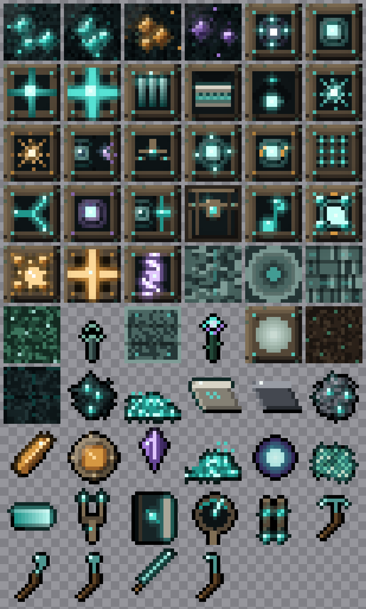
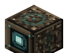
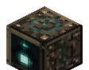
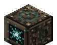
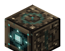
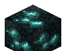

# Octaves of the One — Wiki

Welcome to the wiki for **Octaves of the One** (repository / archive name
`echoes-of-the-deep`, mod id `echoes`) — a Fabric tech mod for Minecraft
**1.21.4** themed on **Walter Russell's cosmology**: the *two-way universe* of
**rhythmic balanced interchange**.

You draw **Light** (the mod's energy) from the still centre of zero, wind it
through the octaves by **generation** (compression / charging) and **radiation**
(expansion / discharging), and spend it across a **wired** and **wireless** grid
to power machines, flight, and deliberately over-tuned gear.

> Energy is *carried, not consumed*. The cosmology framing is **flavour, not
> physics** — but every block maps to one of Russell's ideas. Internally the
> namespace stays `echoes` and energy is tracked as **RU** (Resonance Units) for
> save-compatibility; everywhere a player looks, RU is shown as **Light**.

*Every block and item sprite, in one cohesive "deep resonance" style — sculk-dark
bases, patinated bronze bezels, and teal Light with a recurring sound-wave ripple
motif (amber for percussive gear, amethyst for dimensional gear). All textures are
procedurally generated by
[`gen_textures.py`](https://github.com/Trystar360/echoes-of-the-deep/blob/main/gen_textures.py).*

      

*Blocks are shown as isometric 3D renders throughout the wiki, like a modpack
guide. See [Blocks](Blocks.md) and [Crafting & Progression](Crafting-and-Progression.md)
(every recipe as a crafting-grid widget).*

---

## Wiki pages

| Page | What's in it |
| --- | --- |
| [Getting Started](Getting-Started.md) | Install, build, and your first hour: ore → ingot → first powered machine. |
| [Cosmology & Lore](Cosmology-and-Lore.md) | Russell's two-way universe and how every block maps to it. |
| [Energy System](Energy-System.md) | Light/RU, node roles, the wired grid, fair distribution, persistence. |
| [Blocks](Blocks.md) | Every block: in-world name, internal id, role, capacities, and behaviour. |
| [Items & Gear](Items-and-Gear.md) | Materials, tools, the Centrifugal Thrusters, and handheld diagnostics. |
| [Wireless Transport](Wireless-Transport.md) | Channels (octaves), the Wave Relay, and the full channel-gadget family. |
| [Ores & Worldgen](Ores-and-Worldgen.md) | Echocite, Drumstone, Silentite — where they spawn and what they drop. |
| [Ambient Capture](Ambient-Capture.md) | The sound → Light system: mob deaths and the data-driven sound table. |
| [Crafting & Progression](Crafting-and-Progression.md) | The full recipe reference and tech-tree flow. |
| [Compatibility](Compatibility.md) | Team Reborn Energy bridge and Trinkets. |
| [Reference & FAQ](Reference-and-FAQ.md) | Constants table, id list, troubleshooting. |

---

## At a glance

- **Minecraft:** 1.21.4 (Fabric) · **Loader** ≥ 0.16.0 · **Fabric API** required · **Java** 21
- **Author:** Trystar360 · **License:** MIT
- **Energy unit:** Light (RU internally) · **Wireless channels:** 16 (one per dye colour)
- **Soft deps:** Team Reborn Energy, Trinkets (both optional)

The mod is a complete, end-to-end energy + logistics loop, **craftable from
scratch in survival** — every item is obtainable, with no creative-only stubs.

> **Display vs. internal names.** This wiki leads with the **in-world display
> name** (e.g. *Generative Coil*) and notes the internal id (`echoes:resonator`)
> where it helps. The reskin is display-only; saves stay compatible.

See also the design docs this wiki builds on:
[`cosmology.md`](../cosmology.md), [`wireless_transport.md`](../wireless_transport.md),
and the project [`roadmap.md`](../roadmap.md).
