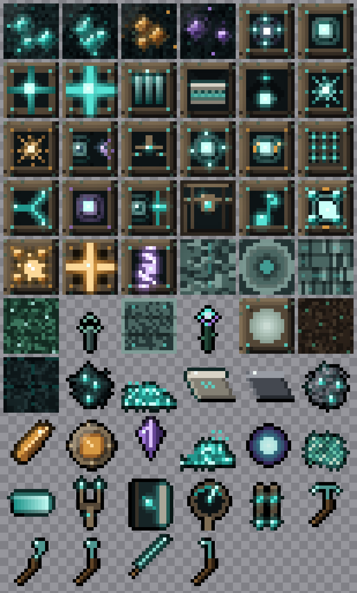

# Echoes of the Deep — Wiki

A Fabric tech mod for Minecraft **26.1.2** (mod id `echoes`), themed on **Walter
Russell's cosmology**: the *two-way universe* of **rhythmic balanced interchange**.

You draw **Light** — the mod's energy — from the still centre of zero, wind it up through
the octaves by **generation** (compression / charging) and pour it back out by
**radiation** (expansion / discharging), then spend it across a **wired** and **wireless**
grid to power machines, flight, farms, and a personal matter-transmutation economy.

> Light is **carried, not consumed**. The cosmology is **flavour, not physics** — but
> every block maps to one of Russell's ideas. Energy is tracked internally as **RU** for
> save-compatibility; everywhere a player looks, it's **Light**.

*Every sprite in one cohesive "deep resonance" style — sculk-dark bases, patinated bronze
bezels, and teal Light with a recurring sound-wave ripple motif (amber for percussive
gear, amethyst for dimensional). All textures are procedurally generated by
[`gen_textures.py`](https://github.com/Trystar360/echoes-of-the-deep/blob/main/gen_textures.py).*

---

## Start here

New to the mod? Read **[Getting Started](Getting-Started.md)** and follow the in-game
**[Great Work](The-Great-Work.md)** advancement tree — it guides the whole progression,
from your first ore to the transmutation economy.

## Wiki pages

| Page | What's in it |
| --- | --- |
| [Getting Started](Getting-Started.md) | Install and your first hour: ore → ingot → first powered machine. |
| [The Great Work](The-Great-Work.md) | The in-game advancement tree and the progression it traces. |
| [Cosmology & Lore](Cosmology-and-Lore.md) | Russell's two-way universe and how every block maps to it. |
| [Energy System](Energy-System.md) | Light/RU, node roles, the wired grid, fair distribution, persistence. |
| [Blocks](Blocks.md) | Every block: name, role, capacities, and behaviour. |
| [Items & Gear](Items-and-Gear.md) | Materials, tools, the Resonant Thrusters, and handheld diagnostics. |
| [Wireless Transport](Wireless-Transport.md) | Channels (octaves), the Wave Relay, and the channel-gadget family. |
| [Transmutation & Light Values](Transmutation.md) | The Bound-Light economy: dissolve, withdraw Motes, condense, Octave Stars. |
| [Ores & Worldgen](Ores-and-Worldgen.md) | Echocite, Drumstone, Silentite — where they spawn and what they drop. |
| [Ambient Capture](Ambient-Capture.md) | The sound → Light system: mob deaths and the data-driven sound table. |
| [Crafting & Progression](Crafting-and-Progression.md) | The full recipe reference and tech-tree flow. |
| [Compatibility](Compatibility.md) | Team Reborn Energy bridge, Trinkets, and the server config file. |
| [Reference & FAQ](Reference-and-FAQ.md) | Constants table, id list, troubleshooting. |

---

## At a glance

- **Minecraft:** 26.1.2 (Fabric) · **Loader** ≥ 0.19.0 · **Fabric API** required · **Java** 25
- **Author:** Trystar360 · **License:** MIT
- **Energy unit:** Light (RU internally) · **Wireless channels:** 16 (one per dye colour)
- **Soft deps:** Team Reborn Energy, Trinkets (both optional)
- **Server config:** `config/echoes.json` (Hush Cost, death capture, thruster tuning)

The mod is a complete, end-to-end energy + logistics + transmutation loop, **craftable
from scratch in survival** — every item is obtainable, with no creative-only stubs.

> **Display vs. internal names.** This wiki leads with the **in-world display name** (e.g.
> *Resonant Coil*) and notes the internal id (`echoes:resonant_coil`) where it helps. Ids
> never change, so saves stay compatible across display renames.
