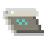
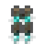

# Items & Gear

[← Home](Home.md)

Materials, tools, flight, and handheld diagnostics. Handheld wireless tools (the
**Wave Tuner** and **Wave Atlas**) are documented on
[Wireless Transport](Wireless-Transport.md).

## Materials

| | In-world name | Id | Source | Use |
| :-: | --- | --- | --- | --- |
|  | Raw Echocite | `raw_echocite` | mining Echocite Ore | smelt → Echo Ingot, or crush → dust |
|  | Echocite Dust | `echocite_dust` | crushing raw echocite (×2) | smelt → Echo Ingot; crafting |
|  | **Echo Ingot** | `echo_ingot` | smelt raw echocite **or** dust | **the core crafting material** |
|  | Echo Dust | `echo_dust` | Echocite Dust + Glowstone Dust | crafts the Wave Atlas |
|  | Resonant Slag | `resonant_slag` | ~15% byproduct of crushing | smelt → Dull Ingot |
|  | Dull Ingot | `dull_ingot` | smelt Resonant Slag | cheap alternate conduit material |
|  | Drumstone Shard | `drumstone_shard` | mining Drumstone Ore | crafts the Drum Core |
|  | Drum Core | `drum_core` | 4 shards + iron | alt Coil membrane; **Thrusters** |
|  | Silentite Crystal | `silentite_crystal` | mining Silentite Ore (Deep Dark) | Stillness Core; alt Wave Repeater |

**Echo Ingot** is the spine of the tech tree — nearly every machine, conduit,
tool, and wireless device needs it. The **Dull Ingot** and **Drum Core** lines
are cheaper/alternate paths so the loop has redundancy. See
[Crafting & Progression](Crafting-and-Progression.md).

## The transmutation economy — Bound Light (EMC)

Russell's premise is that **all matter is condensed Light**, so the mod has a native
EMC: every item carries a **Light Value** (its *Bound Light*). Each player has a personal
**Bound-Light account** — a pool of banked Light plus the set of *attuned* tones they've
learned — and two terminals open it:

- the **[Transmutation Table](Blocks.md)** (block), and
- the 
  **Transmutation Tablet** (`transmutation_tablet`) — the portable version; right-click to
  open the same account anywhere.

At either terminal you can **Dissolve** an item (banks its Light Value and *attunes* it),
**Withdraw** Mote coins, or **Condense** an attuned item — set it in the ghost template
slot and spend Bound Light to re-create it (×1 or a stack). The Mote ladder is the
denomination scale — each tone is Light wound one octave higher (×4 per octave):

| | In-world name | Id | Light Value | Tone |
| :-: | --- | --- | --: | --- |
|  | Light Mote | `light_mote` | 64 | O0 — raw Light, the universal One |
|  | Tonic Mote | `tonic_mote` | 256 | O1 — the tonic |
|  | Mediant Mote | `mediant_mote` | 1,024 | O2 — the mediant |
|  | Dominant Mote | `dominant_mote` | 4,096 | O3 — the dominant |
|  | Harmonic Mote | `harmonic_mote` | 16,384 | O4 — the resolved crest (balance) |

Light Values are **data-driven** (`data/echoes/light_values.json`, modpack-overridable);
items absent from the table — or set to `0` — cannot be dissolved, which keeps unique and
exploit items out of the economy.

##  Resonant Thrusters — `echoes:resonant_thrusters`

*Centrifugal radiation = expansion.* **Sound-powered flight** with no client mod
— fully server-side. Portable Light lives on the item via a `stored_ru` data
component.

- **Capacity:** 1,000,000 RU (a huge reserve).
- **Flight:** hold *use* to fly in the direction you look. **Sprint** = faster,
  **sneak** = hover / brake. Costs only **~8 RU/t** to fly, so the reserve lasts.
- **Fall-damage immunity** while you carry a charged set.
- **Recharge:** right-click a **Resonant Coil**, **Resonance Cell**, or **Polarity
  Coupler** to pull Light into the thrusters.
- Tooltip shows current charge (`Light: x / y`).

Crafted from **Echo Ingots**, a **Redstone Block**, and two **Drum Cores**.

## Resonant tools

    

A full set — **Pickaxe, Axe, Shovel, Sword, Hoe** — on the custom **Echo** tool
material (`ModItems.ECHO_MATERIAL`). Deliberately over-tuned (the cosmology
justifies it):

| Property | Value |
| --- | --- |
| Mining speed | **12.0** (faster than netherite) |
| Mining level | mines **anything** |
| Durability | **4,000** |
| Enchantability | **22** (very high) |
| Repair material | `#echoes:resonant_repair` tag (Echo Ingot) |

Each tool adds its usual attack-damage/speed profile on top. The constants live
in `ModItems.ECHO_MATERIAL` and the individual `Resonant*Item` classes for easy
re-balancing. Crafted from **Echo Ingots + sticks** in the vanilla tool shapes.

## Diagnostics & tuning (handheld)

###  Light Meter — `echoes:light_meter`
Right-click any Light device to print its **role, stored / capacity Light,
demand, and conduit throughput** in chat. Light is otherwise invisible, so this is
your primary debugging tool. Crafted from an Echo Ingot + redstone + comparator.

###  Wave Tuner — `echoes:wave_tuner`
Copy/paste a wireless **channel** between devices: sneak + right-click a device to
copy its octave, right-click another to paste. Batch-tune without dyes.

###  Wave Atlas — `echoes:wave_atlas`
Right-click a device to print its channel roster (device / give / regive / shaper
counts); right-click the air for an overview of every active channel.

Both wireless tools are detailed on [Wireless Transport](Wireless-Transport.md).
