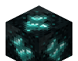
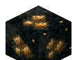
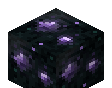

# Ores & Worldgen

[← Home](Home.md)

Three ores feed the tech tree. Worldgen is attached via Fabric
`BiomeModifications` (`ModWorldGen`); all three drop their material with a
standard Fortune bonus.

##   Echocite Ore — `echoes:echocite_ore` (+ `deepslate_echocite_ore`)

The backbone resource. Generates throughout the **Overworld** in both stone and
deepslate, dropping **Raw Echocite**.

| Property | Value |
| --- | --- |
| Where | Overworld (all standard biomes) |
| Drops | Raw Echocite (Fortune-affected) |
| Vein size | 8 |
| Veins / chunk | 12 |
| Height | trapezoid distribution, **y −20 → 60** |
| Targets | `stone_ore_replaceables` (→ echocite) and `deepslate_ore_replaceables` (→ deepslate variant) |

##  Drumstone Ore — `echoes:drumstone_ore`

A percussive tier. Generates **deeper** in the Overworld and drops **Drumstone
Shard** → **Drum Core** (an alternate Coil membrane, and the Thrusters ingredient).

| Property | Value |
| --- | --- |
| Where | Overworld |
| Drops | Drumstone Shard (Fortune-affected) |
| Vein size | 6 |
| Veins / chunk | 5 |
| Height | trapezoid, **y −48 → 24** |

##  Silentite Ore — `echoes:silentite_ore`

The rarest tier, the "silence / unstruck tone" line. Generates **only in the Deep
Dark** and drops **Silentite Crystal** (for the **Stillness Core** and an
alternate **Octave Repeater**).

| Property | Value |
| --- | --- |
| Where | **Deep Dark only** |
| Drops | Silentite Crystal (Fortune-affected) |
| Vein size | 4 |
| Veins / chunk | 4 |
| Height | uniform, **y −58 → −8** |
| Targets | `deepslate_ore_replaceables` |

## Notes

- Worldgen is data-driven under
  `data/echoes/worldgen/{configured_feature,placed_feature}/` — a pack author can
  override spawn rates without touching code.
- On a fresh world load the server logs the biome modifications being applied
  (e.g. *"Applied 54 biome modifications"*), confirming the ores attached.
